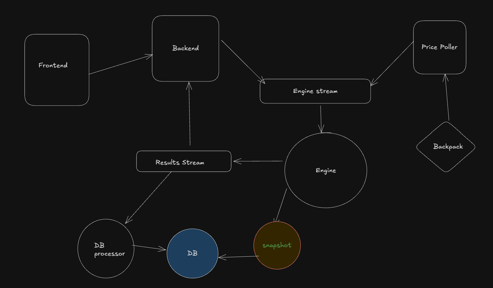

# 🪙 TradePro – CFD Platform

A high-performance **Contract for Difference (CFD) trading platform** built as a monorepo.  
It includes a real-time price polling, engine processing orders, database processors to put entry of positions and balances in db, backend APIs, frontend interface, and testing suite — all designed to simulate leveraged trading, order execution, and PnL tracking.

-------

## 🏗️ Architecture

------

## 🛠️ Tech Stack
**Frontend**
- Next.js
- TailwindCSS
- shadcn/ui

**Backend**
- Express.js
- Websocket
- Redis (Redis Streams)
- bun:test (for tests)

**Database**
- Prisma + PostgreSQL (for users, balances, etc.)
-------